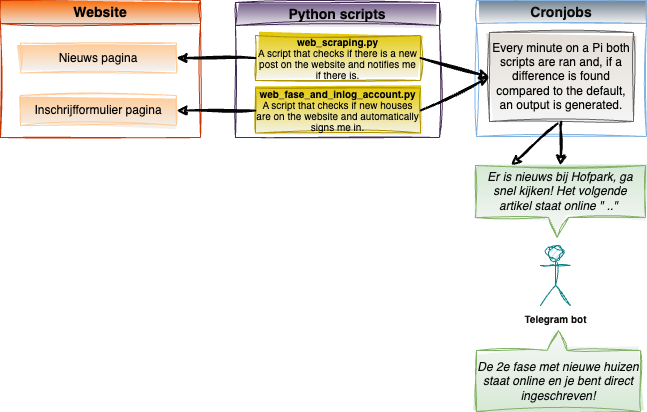

### Introduction 
The goal of this project was to analyze the status of a new housing project that was initiated in Houten.
For this project I used my Raspberry Pi and created a couple of cronjobs to constantly check the website and its information. 

#### Design / setup of the project:

     

#### Starting date
Dec 27, 2021

#### Context
nieuwbouwinhouten.nl was a website that posts updates about the Hofpark project. The plan of this project was to built houses in Houten-Zuid. It was a first come first serve project. So, whomever signed up for a specific phase first in line, also got the highest chances of getting a house. Phase 1 was already live and we signed up for it too late. Therefore, i decided to built a house scraper which would get me ready for phase 2. Sadly, phase 2 never went live (classic), so I only got to test my product on phase 1 data ... But still, that worked pretty nice  :wink:.

     

I created two functionalities based on the website:

> (1) scrape the blog/news section and send a telegram message whenever a new post was added (web_scraping.sh)

> (2) check if a new phase of the project was going live. If this was the case, automatically sign me up and send me a telegram message (web_fase_and_inlog_account.sh)

I ran this on my Pi with a cronjob every minute

#### Tech and Tools
Raspberry Pi, cronjobs, sh files, webscraping (BeautifulSoup and Selenium), configparser, Telegram, black, flake8